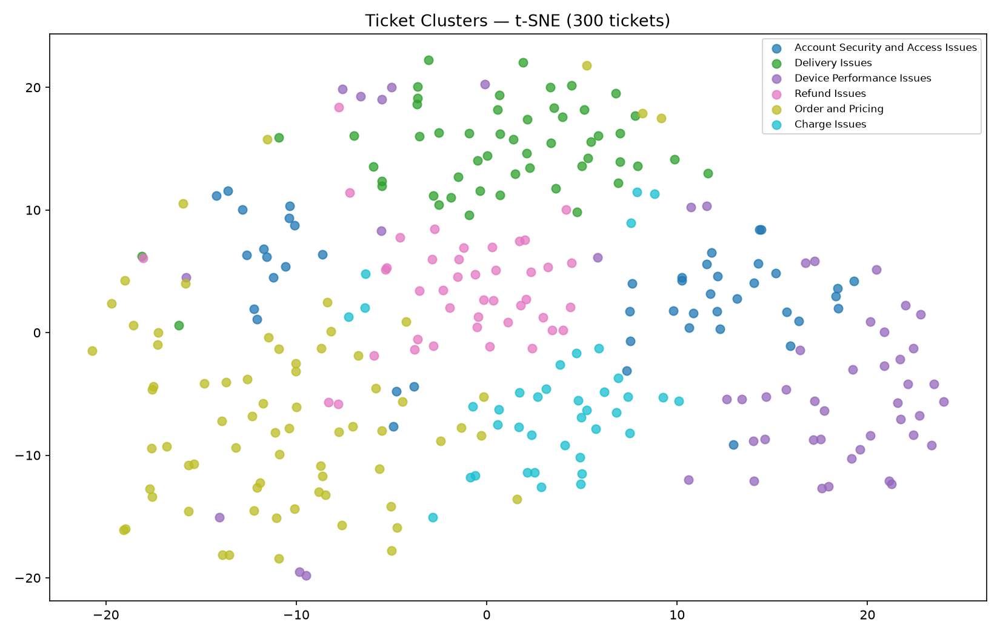

# Результати: Автокатегоризація тікетів через Embeddings

> Swift-порт домашки (SwiftPM CLI замість `starter.py`): embeddings — MLX (`all-MiniLM-L6-v2`, звірені повекторно з sentence-transformers), k-means/BM25/cosine/RRF — власні реалізації на Accelerate, vector DB — USearch (embedded HNSW) замість Qdrant `:memory:`, LLM-нейминг — Apple Foundation Models (on-device, без API-ключа), reranker-и — CoreML. Запуск: `./run.sh` (повний), `./run.sh --quick --query "..."`, `./run.sh --rerank --query "..."`. Сирі виводи прогонів, з яких заповнені таблиці нижче — у [`runs/`](runs/).

---

## 1. Кластеризація

**Датасет:** 300 synthetic support tickets (7 ground-truth категорій ×~43)

**Embedding модель:** all-MiniLM-L6-v2 (384d, mean pooling + L2)

### Пошук оптимального k

| k  | ARI score |
|----|-----------|
| 3  | 0.318     |
| 4  | 0.388     |
| 5  | 0.505     |
| 6  | **0.540** |
| 7  | 0.502     |
| 8  | 0.508     |
| 9  | 0.482     |
| 10 | 0.428     |
| 12 | 0.437     |

**Оптимальне k:** 6 — **ARI:** 0.540

**Чому саме це k?** Ground-truth категорій 7, але дві з них семантично зливаються (billing + general → один кластер «Order and Pricing»), тому пік на 6. Вище шести справжні категорії починають дробитись на підтеми, і ARI за це карає. Числа звірені зі sklearn на тих самих ембеддингах — збіг до 3-го знаку.

### Візуалізація t-SNE

Delivery / Refund / Charge / Device — чіткі острови; «Order and Pricing» розмазаний (це і є злиплий billing+general); Account видно двома острівцями — login-проблеми і identity-verification.

### Таблиця кластерів

| # | Назва від LLM (Foundation Models) | К-ть тікетів |
|---|-----------------------------------|-------------|
| 0 | Account Security and Access Issues | 46 |
| 1 | Delivery Issues                    | 52 |
| 2 | Device Performance Issues          | 52 |
| 3 | Refund Issues                      | 42 |
| 4 | Order and Pricing                  | 70 |
| 5 | Charge Issues                      | 38 |

Нейминг детермінований (greedy sampling): два прогони — ідентичні назви.

---

## 2. Порівняння методів пошуку

### Запит 1: `"my laptop screen is broken"` → очікувана категорія: `technical`

| Метод      | Час (ms) | Топ-1 результат (коротко)                  | Recall 3/5 |
|------------|----------|--------------------------------------------|------------|
| BM25       | 0.13     | [technical] laptop screen flickers…        | так (3/5)  |
| Cosine     | 0.04     | [returns] cracked screen out of the box…   | так (3/5)  |
| Fusion RRF | 0.02     | [technical] laptop screen flickers…        | так (3/5)  |
| USearch    | 0.07     | [returns] cracked screen out of the box…   | так (3/5)  |

### Запит 2: `"I can't authenticate my identity"` → очікувана категорія: `account`

| Метод      | Час (ms) | Топ-1 результат (коротко)                  | Recall 3/5 |
|------------|----------|--------------------------------------------|------------|
| BM25       | 0.08     | [account] identity verification, ID photo… | так (4/5)  |
| Cosine     | 0.02     | [account] identity verification, ID photo… | так (5/5)  |
| Fusion RRF | 0.00     | [account] identity verification, ID photo… | так (5/5)  |
| USearch    | 0.05     | [account] identity verification, ID photo… | так (5/5)  |

### Запит 3: `"money problems with my purchase"` → очікувана категорія: `billing`

| Метод      | Час (ms) | Топ-1 результат (коротко)                  | Recall 3/5 |
|------------|----------|--------------------------------------------|------------|
| BM25       | 0.06     | [billing] purchase order number missing…   | ні (2/5)   |
| Cosine     | 0.02     | [returns] account doesn't show purchase…   | так (3/5)  |
| Fusion RRF | 0.00     | [returns] account doesn't show purchase…   | так (4/5)  |
| USearch    | 0.06     | [returns] account doesn't show purchase…   | так (3/5)  |

### Запит 4: `"package not delivered to my address"` → очікувана категорія: `shipping`

| Метод      | Час (ms) | Топ-1 результат (коротко)                  | Recall 3/5 |
|------------|----------|--------------------------------------------|------------|
| BM25       | 0.10     | [account] change the email address…        | ні (2/5)   |
| Cosine     | 0.02     | [shipping] courier marked as delivered…    | так (5/5)  |
| Fusion RRF | 0.00     | [shipping] package returned to sender…     | ні (2/5)   |
| USearch    | 0.05     | [shipping] courier marked as delivered…    | так (5/5)  |

### Запит 5: `"want to send the item back for a refund"` → очікувана категорія: `returns`

| Метод      | Час (ms) | Топ-1 результат (коротко)                  | Recall 3/5 |
|------------|----------|--------------------------------------------|------------|
| BM25       | 0.14     | [returns] returned the wrong item…         | так (4/5)  |
| Cosine     | 0.02     | [returns] returned the wrong item…         | так (4/5)  |
| Fusion RRF | 0.00     | [returns] returned the wrong item…         | так (4/5)  |
| USearch    | 0.06     | [returns] returned the wrong item…         | так (4/5)  |

### Приклад: Ticket Helper

**Новий тікет:** "want to send the item back for a refund"

**Підказана категорія (majority top-3):** returns

**Найближча назва кластера (k-means + LLM):** Refund Issues

**Подібні звернення:**
1. [returns] I returned the wrong item by mistake — how do I send back the correct one
2. [billing] I requested a partial refund for an item I returned but got nothing
3. [returns] I changed my mind and want to return the item — is the return window still open

---

## 3. Latency-Quality Frontier

Середнє по 5 демо-запитах (пошук, без ембеддингу запиту):

| Метод                            | Avg recall@5 | Avg latency (ms) | Production-ready? |
|----------------------------------|--------------|------------------|-------------------|
| BM25 keyword                     | 3.0 / 5      | 0.10 ms          | ✓ (для keyword)   |
| Cosine Accelerate *(baseline)*   | 4.0 / 5      | 0.03 ms          | ✗ O(n), не масштабується |
| USearch HNSW *(замість Qdrant)*  | 4.0 / 5      | 0.06 ms          | ✓ (vector DB)     |

**USearch vs Cosine overlap:** 25/25 (5/5 на кожному запиті)

**Висновок:** Найвищий recall — у семантичних методів: cosine і USearch по 4.0/5 (пороги eval перекриті: cosine ≥3/5, BM25 ≥2/5, vector DB ≥3/5). Для production helpdesk я б узяв vector DB (USearch/Qdrant) + reranker на top-K: та сама якість, що в brute-force cosine, але HNSW шукає за O(log n). Brute-force cosine на 300 тікетах швидший за HNSW (0.03 проти 0.06 ms) — але це O(n) скалярних добутків на кожен запит: на мільйоні тікетів це вже мілісекунди-десятки мілісекунд лінійного скану, а HNSW лишається на місці.

---

## 4. Висновки

**1. BM25 vs cosine.** BM25 виграє, коли в запиті ті самі слова, що в тікеті: у запиті 5 «send back / refund» — точний лексичний матч, 4/5. Cosine виграє на парафразах: у запиті 4 «package not delivered» BM25 зачепився за «address» і притягнув «change the email address» (account) — 2/5, а cosine зрозумів сенс і дав 5/5 shipping.

**2. USearch vs cosine.** Overlap 25/25, скори збігаються до 4-го знаку. Так і має бути: обидва рахують той самий cosine на тих самих нормалізованих векторах, а HNSW на 300 точках фактично вироджується в точний пошук. Vector DB тут виграє не якістю, а масштабованістю.

**3. ARI-таблиця.** Пік на k=6 (0.540). Нижче — різні категорії склеюються в один кластер (на k=3 ARI 0.318). Вище — справжні категорії дробляться на підтеми (Account → login vs identity-verification), і ARI падає до 0.43–0.44 на k=10–12.

**4. Fusion RRF.** Впливає в обидва боки. Запит 1: витягнув technical-тікет у топ-1 замість returns у cosine. Запит 3: підняв recall до 4/5 (краще за обидва методи окремо). Але запит 4 — найбільша різниця: BM25-сміття (2/5) протягнулось у fusion і зіпсувало cosine з 5/5 до 2/5. RRF усереднює — він і рятує, і тягне вниз, якщо один із методів відверто промахнувся.

**5. Latency-quality tradeoff.** Що точніший метод, то дорожчий: BM25 (лексика, найдешевший) → bi-encoder cosine (семантика, дорожчий на індексації) → cross-encoder reranker (найточніший, О(n) forward-pass-ів на кожен запит: 78–307 ms на пару проти 0.06 ms на весь запит у USearch). Pareto frontier на таблиці вище — USearch: recall як у brute-force, latency константна за масштабом. Production-схема: vector DB відбирає top-50–200 → cross-encoder переранжовує → користувачу йде top-5.

---

## 5. Бонус: Reranker порівняння

Запуск: `./run.sh --clusters 6 --quick --query "I can't log into my account" --rerank`. Кандидати — cosine top-5, скор — сирий logit cross-encoder-а.

| Модель              | Топ-1 результат (коротко)                     | Precision@1 | Latency (score, 5 пар) |
|---------------------|-----------------------------------------------|-------------|------------------------|
| ms-marco-MiniLM     | Can't log in even though password is correct  | так         | 693 ms  |
| bge-reranker-base   | Someone accessed my account without permission| так         | 390 ms  |
| bge-reranker-v2-m3  | Can't log in even though password is correct  | так         | 1 538 ms |

**Яка модель дала найкращий результат?** За ranking-ом — bge-v2-m3: топ-1 буквально відповідає запиту, і решта порядку найосмисленіша (locked account другим, password-reset останнім). bge-base поставив на перше місце «Someone accessed my account» — з'їхав у security-інтерпретацію.

**Чому ms-marco програє на коротких support-ticket текстах?** Вона тренована на MS MARCO — веб-запити Bing проти веб-пасажів, тобто на лексичну релевантність довгих документів. На коротких support-парафразах це дає екстремально роздуту шкалу (від +3.2 до −9.7 на п'яти сусідніх тікетах) і промахи на переформулюваннях, тоді як bge-моделі треновані на парах питання-відповідь і тримають рівнішу шкалу.

**Верифікація (Swift-порт):** усі три моделі звірені з sentence-transformers `CrossEncoder` на 2 demo-запитах: bge-v2-m3 — збіг логітів до 3–4 знаку, bge-base — Δ ≤ 0.01, ms-marco — ranking точний, дрейф ≤ 0.17 (INT8-квантизація community-конверсії). Готова CoreML-конверсія bge-v2-m3 з HF виявилась числово битою (FP16-overflow: NaN на CPU, сміття-логіти на GPU) — довів ізоляційним тестом через coremltools і замінив власною FP32-конверсією (`scripts/convert_bge_v2m3_coreml.py`), яка збігається з torch до останнього знаку.

**Обмеження:** top-5 кандидатів — демо-масштаб; reranker не додає recall, лише precision. У проді пул був би 50–200 кандидатів від retriever-а.

---

## 6. Бонус: свій запит

**Мій запит:** "the money left my card but the order still shows unpaid"

| Метод        | Топ-1 результат (коротко)                          | Overlap з Cosine |
|--------------|----------------------------------------------------|-----------------|
| BM25         | [shipping] contactless delivery, driver rang bell… | 0 / 5           |
| Cosine       | [billing] charged after I removed payment method…  | —               |
| USearch      | [billing] charged after I removed payment method…  | 5 / 5           |

Запит навмисно без «платіжних» слів (charge, payment, billing) — і BM25 повністю розсипався: зачепився за службові «left / shows / still / order» і приніс shipping/technical/account, нуль перетину з cosine. Cosine же дав 5/5 billing — семантика «гроші зняли, замовлення неоплачене» зчиталась без жодного спільного ключового слова.
