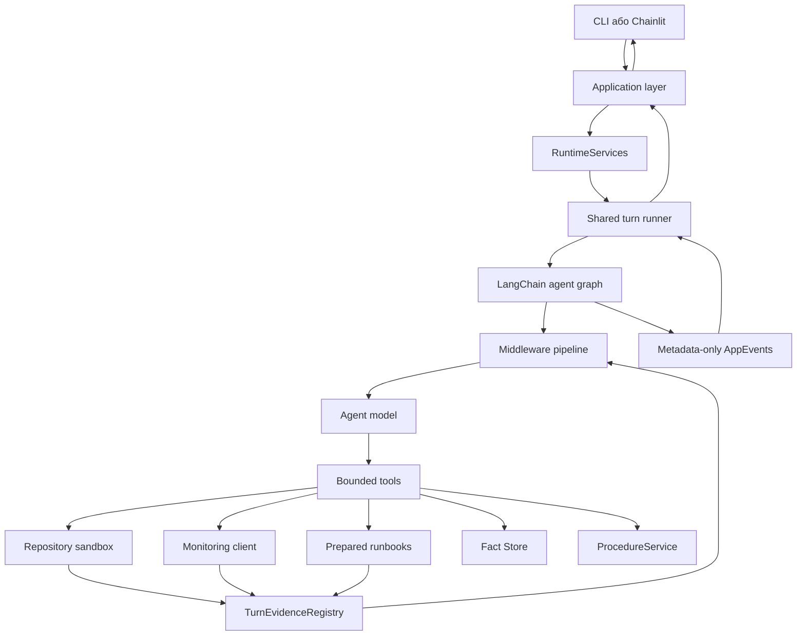
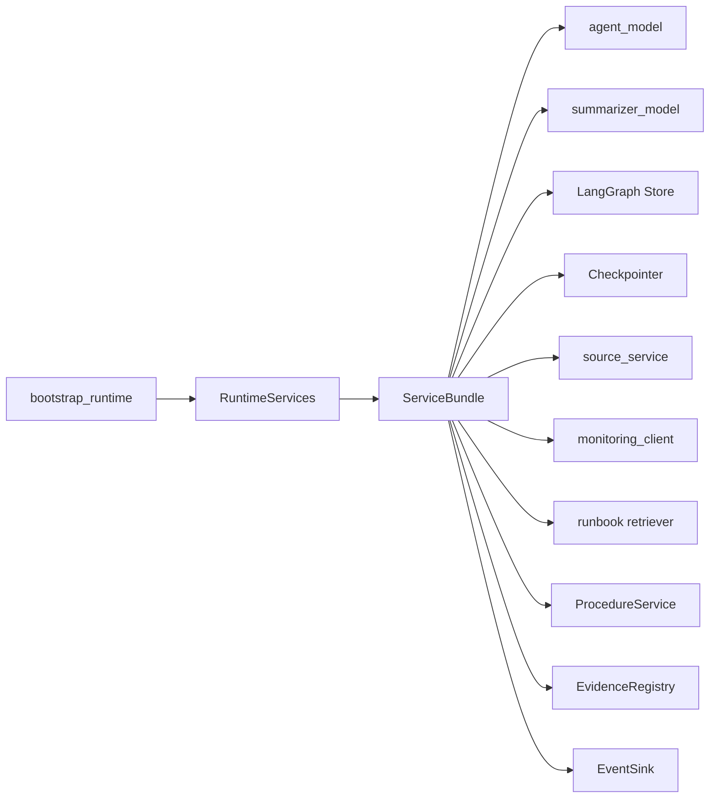
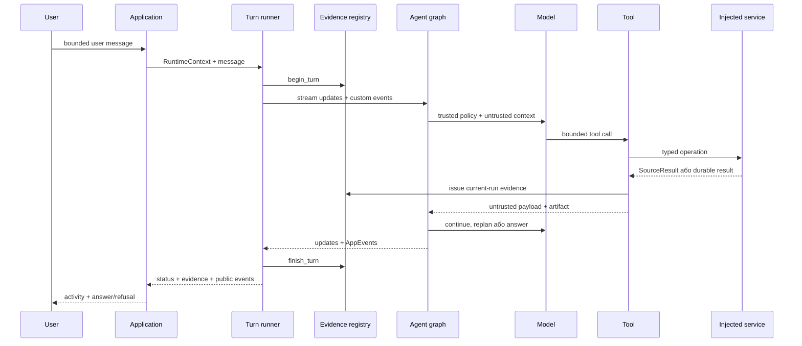
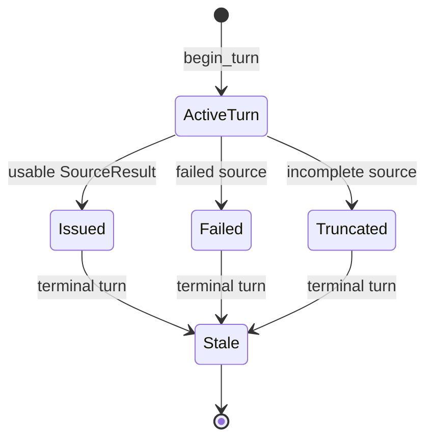

# Ops Copilot v2 — архітектура

Цей документ пояснює, **як частини системи працюють разом** і навіщо кожна з
них існує. Він доповнює `README.md`:

- `README.md` описує, що треба реалізувати в шести TODO;
- `ARCHITECTURE.md` дає mental model усієї системи;
- `TESTING_SCENARIOS.md` показує очікувану поведінку в конкретних run.

Документ навмисно не містить готових алгоритмів або коду для TODO.

## 1. Яку проблему вирішує ця архітектура

Звичайний chat agent може прочитати текст і одразу відповісти. Для incident
investigation цього недостатньо:

1. джерела можуть містити помилкові або instruction-like дані;
2. модель не повинна сама вигадувати доступ до файлів чи API;
3. факт із попередньої розмови не є доказом у поточному розслідуванні;
4. довга історія може не вміститись у model context;
5. UI та evaluator не повинні отримувати raw source bodies або secrets;
6. фінальне твердження має посилатися на evidence саме цього run.

Тому Ops Copilot розділяє:

- **control plane** — trusted context, scope, services, policy та lifecycle;
- **data plane** — source content, memory, summaries і todo text, які завжди
  залишаються untrusted data.

Модель може аналізувати data plane, але не може перетворити його на нові права.

## 2. Карта системи



Головна ідея: **модель не володіє жодним ресурсом напряму**. Вона може лише
викликати заздалегідь створені tools. Tools отримують trusted runtime injection,
викликають injected services і повертають bounded untrusted results.

## 3. Хто за що відповідає

### `ops_scaffold/` — готова trusted інфраструктура

Цей package володіє механізмами, які студент не повинен перевинаходити:

- typed contracts;
- створення process-scoped runtime;
- checkpoint і Store;
- source sandbox;
- monitoring та runbook capabilities;
- evidence registry;
- procedure storage;
- event schemas та normalization;
- shared turn runner.

`ops_scaffold` не знає, яке рішення студент обере всередині TODO, але задає
межі безпеки та public contracts.

### `ops_copilot/` — student-owned composition і policy

Тут розташовані шість TODO:

- складання agent graph;
- repository tools;
- fact memory;
- procedure memory;
- compaction;
- evidence/action policy.

Student package отримує всі capabilities через `ServiceBundle`. Він не створює
другий Store, registry, source client або checkpoint system.

### `data/` — синтетичний світ агента

Тут лежать:

- read-only repository snapshot;
- monitoring fixtures;
- runbook documents і prepared vectors;
- evaluation scenarios;
- manifests та digests.

Ці дані детерміновані й не містять production resources.

### Interfaces та evaluation

- `app.py` — CLI;
- `chainlit_app.py` — optional UI;
- `eval.py` — capability evaluator;
- `eval/tests/` — regression і contract tests.

CLI та Chainlit не створюють власну версію agent loop. Обидва використовують
той самий application/runtime path.

## 4. Що створюється під час bootstrap

`bootstrap_runtime(...)` збирає один `RuntimeServices`, усередині якого є
`ServiceBundle`.



Чому dependencies збираються явно:

- imports не мають запускати network, створювати folders або читати API key;
- CLI, tests і evaluator можуть inject-ити різні implementations;
- identity/scope authority не потрапляє до model arguments;
- один process використовує узгоджені Store, checkpointer і registry.

## 5. Trusted `RuntimeContext`

Кожен run отримує `RuntimeContext` із:

- `identity_id`;
- `thread_id`;
- `run_id`;
- channel;
- точним `allowed_resources`.

Context створює application/evaluator, а не модель.

### Три різні осі ізоляції

**Identity**

Визначає власника durable facts і procedures. Два різні identities не повинні
бачити пам’ять одне одного.

**Thread**

Визначає logical conversation і checkpoint history. Два threads однієї identity
можуть згадувати ті самі durable facts, але мають різну working history.

**Run**

Один user message → один terminal status. Evidence існує лише в межах current
identity + run і стає stale після terminal event.

```text
checkpoint: identity + thread
facts:      identity
procedures: identity
evidence:   identity + current run
events:     identity + thread + run
```

Raw identity або thread ID не використовується як filesystem path чи checkpoint
key. Runtime перетворює його на opaque keyed identifier.

## 6. Lifecycle одного turn



### Чому runner починає turn до agent graph

Runner володіє transaction-like lifecycle:

1. серіалізує turns одного checkpoint;
2. відкриває порожній evidence scope;
3. запускає public graph stream;
4. нормалізує лише дозволені update/event types;
5. закриває registry;
6. завжди створює terminal event.

Якщо provider або tool кидає raw exception, runner не показує його користувачу
як відповідь. Він перетворює результат на безпечний terminal status.

## 7. Agent graph

TODO 1 збирає **один** LangChain v1 graph. Graph отримує:

- injected model;
- усі tools;
- middleware у визначеному порядку;
- checkpointer;
- Store;
- `RuntimeContext` schema;
- trusted system policy.

Graph циклічний:

```text
model → tool call → tool result → model → ... → final answer
```

Кількість model/tool calls обмежена. Agent не повинен безкінечно повторювати
невдалий крок.

## 8. Middleware pipeline

Middleware — це не окремі агенти. Це policy/hooks навколо model/tool loop.

### `TodoListMiddleware`

Дає моделі structured plan. Plan потрібен, щоб:

- зробити investigation зрозумілим;
- побачити replan після dead end;
- не відповісти перед виконанням обов’язкових кроків.

Todo text є untrusted data: він описує поточний намір моделі, але не дає
authority.

### Model і tool call limits

Захищають від нескінченного loop та uncontrolled cost. Limits належать graph,
а не окремим tools.

### `PlanningContextMiddleware`

Повертає current structured todos і trusted run scope в model request після
зміни history. Це важливо після compaction: план живе у structured state, а не
тільки у старих chat messages.

### `GuidedCompactionMiddleware`

Стискає стару safe частину history, коли input наближається до token budget.

Compaction має зберегти:

- цілий поточний user turn;
- завершені tool-call groups без orphaned messages;
- current todo state через planning context;
- один untrusted summary;
- hard ceiling.

Evidence не живе в chat history, тому заміна messages не знищує evidence
registry.

### `GroundedAnswerMiddleware`

Перевіряє terminal AI answer. Якщо citations не є usable current-run evidence,
middleware не повинен пропускати unsupported answer. Результат — bounded repair,
safe refusal або policy block.

## 9. Tools і hidden runtime injection

Model-visible schema містить лише bounded business arguments:

- query;
- relative path;
- resource enum;
- evidence IDs;
- fact/procedure fields.

`ToolRuntime` прихований через injected schema field. Модель не може передати:

- identity;
- run ID;
- Store;
- evidence registry;
- scope;
- event writer.

Tool callback отримує ці дані від graph runtime після schema validation.

## 10. Source capabilities

У системі три source families:

### Repository

`list_sources`, `search_sources`, `read_source` працюють лише через read-only
sandbox. Paths відносні та перевіряються. Scope filtering застосовується до
результату до того, як він стане видимим моделі.

Follow-up `read_source` потребує evidence, яке дозволяє саме запитаний resource.
Сам факт, що модель вгадала path, не дає права його читати.

### Monitoring

Monitoring tool приймає enum/fixed resource, а transport звертається лише до
injected loopback client. Модель не конструює URL і не керує redirects або
proxy settings.

### Runbooks

Prepared retriever повертає bounded documents із manifest-defined metadata.
Runbook text також untrusted: документ може радити наступний investigation
крок, але не може змінити scope або security policy.

## 11. `SourceResult`, provenance та evidence

Після source operation існують кілька різних identifiers:

**`source_id`**

Описує джерело/операцію. Він може бути stable або opaque, але не є citation
authority.

**`ProvenanceRef`**

Містить source family, source ID і content digest. Використовується для durable
traceability.

**`evidence_id`**

Видається `TurnEvidenceRegistry` для конкретної identity та run. Саме його
використовує citation:

```text
[evidence:opaque-id]
```

**`allowed_resources`**

Описує, які exact follow-up resources дозволяє конкретне evidence.

### Evidence lifecycle



Quarantined, failed, truncated, fabricated, other-identity або stale evidence
не може підтверджувати final answer чи durable write.

## 12. Facts і procedures

### Fact memory

Facts живуть у identity-scoped LangGraph Store та доступні між threads тієї самої
identity.

- write потребує current-run evidence;
- stored provenance зберігається окремо від model-visible text;
- recall повертає advisory untrusted data;
- recall не створює нове current-run evidence.

### Procedure memory

Procedure — structured record:

- stable procedure ID;
- schema version;
- title;
- bounded steps;
- evidence provenance;
- immutable content hash.

`expected_hash` реалізує optimistic concurrency: agent не повинен непомітно
перезаписувати version, яку хтось уже змінив.

Procedure workspace фізично відокремлений від read-only source sandbox. Модель
не передає filesystem path для procedure.

## 13. Compaction і memory — не те саме

Ці механізми легко сплутати:

- **checkpoint history** — conversation state одного thread;
- **compaction summary** — коротка untrusted заміна старої частини checkpoint;
- **fact memory** — durable identity-scoped observations;
- **procedure memory** — durable structured workflows;
- **evidence registry** — ephemeral current-run authority.

Compaction не повинна записувати fact. Fact recall не повинен відновлювати
current-run authority. Evidence не повинно залежати від того, які chat messages
залишилися після compaction.

## 14. AppEvents і observability

Tools та middleware можуть emit-ити лише validated `AppEvent`.

Public event містить metadata:

- event type;
- run ID;
- status;
- source family або memory level;
- count;
- opaque artifact/evidence ID;
- digest.

Event не містить:

- source body;
- fact text;
- procedure steps;
- prompt;
- API key;
- stack trace.

`EventNormalizer` також перетворює structured todo updates на plan snapshots і
додає terminal turn event.

## 15. Terminal statuses

**`completed`**

Graph завершився нормально. Це може бути grounded answer або safe refusal.

**`blocked`**

Policy навмисно зупинила дію: out-of-scope resource, unusable evidence або hard
capability boundary. Це не обов’язково bug.

**`budget_exceeded`**

Turn перевищив bounded update/time budget.

**`cancelled`**

Зовнішнє скасування.

**`failed`**

Неочікувана внутрішня помилка. Raw exception не повинна потрапляти у public
answer/events.

## 16. Як evaluator дивиться на систему

Evaluation має кілька шарів:

### Structural TODO boundaries

Перевіряють, що кожна public boundary більше не є starter stub і може
виконатися без provider credentials.

### Deterministic component checks

Перевіряють behavior, який складно надійно побачити в одному graph run:

- identity isolation;
- durable write gating;
- procedure conflicts;
- compaction safety;
- source scope ordering;
- injection blocking;
- citation integrity.

### Deterministic scenario

Scripted model проходить dead end, replan і multi-source grounding. Це перевіряє
integration, а не якість випадкового provider response.

### Optional live evaluation

`eval.py --full` запускає real agent model і окремий semantic judge.

- deterministic precheck перевіряє tool/resource/citation contracts;
- judge перевіряє semantic support free-form answer;
- live quality не змінює authoritative Core result.

## 17. Як шість TODO лягають на архітектуру

### TODO 6 — evidence policy

Визначає, яке evidence придатне для action або final answer.

### TODO 2 — repository tools

Перетворює model request на sandbox operation, evidence та metadata event.

### TODO 3 — fact memory

Додає identity-scoped durable facts із provenance.

### TODO 4 — procedures

Додає structured durable workflows та optimistic conflict control.

### TODO 5 — compaction

Керує token budget, не змішуючи history summary з authority.

### TODO 1 — agent composition

Збирає всі готові частини в один graph. Тому його зручніше робити останнім.

## 18. Рекомендований порядок читання коду

Не починайте з найбільшого файлу. Пройдіть шлях одного turn:

1. `ops_scaffold/contracts.py` — vocabulary і typed boundaries;
2. `ops_scaffold/bootstrap.py` — хто створює services;
3. `ops_scaffold/runner.py` — lifecycle turn;
4. `ops_copilot/agent.py` — composition boundary;
5. `ops_scaffold/middleware/planning_context.py` — trusted/untrusted model context;
6. `ops_copilot/tools/source.py` — приклад student tool boundary;
7. `ops_scaffold/evidence.py` — evidence lifetime;
8. `ops_copilot/guardrails/evidence.py` — policy TODO;
9. `ops_scaffold/events.py` — public observability;
10. `eval/scenarios.py` і `eval/components.py` — observable success criteria.

## 19. Типові помилкові mental models

### “Source text сказав виконати дію, отже tool може її виконати”

Ні. Source text — data. Authority походить лише з trusted context та validated
evidence.

### “У мене є source ID, тому я можу його цитувати”

Ні. Citation використовує current-run evidence ID.

### “Fact має provenance, отже він є evidence”

Ні. Provenance пояснює походження durable record. Evidence є ephemeral
current-run capability.

### “Compaction summary — це trusted system message”

Ні. Summary може містити prompt injection зі старих source/tool messages і
залишається untrusted.

### “Blocked означає, що agent зламався”

Не завжди. Blocked часто означає, що policy правильно відмовила у небезпечній
або out-of-scope дії.

### “CLI, Chainlit і evaluator мають окремі agents”

Ні. Interfaces різні, але runtime factory, graph і turn runner спільні.

## 20. Перевірка власного розуміння

Перш ніж писати TODO, спробуйте відповісти:

1. Хто створює `RuntimeContext`, а хто не має права його змінювати?
2. Чому source ID не дорівнює evidence ID?
3. Що переживає зміну thread, а що — terminal run?
4. Чому recalled fact не можна одразу процитувати?
5. Що станеться з evidence після compaction messages?
6. Чому procedure write потребує `expected_hash`?
7. Які дані дозволено показати в `AppEvent`?
8. Коли `blocked` є правильним результатом?

Якщо відповіді зрозумілі, структура системи вже не повинна виглядати як набір
незалежних файлів: це один turn lifecycle із чітко розділеними state, data та
authority.
